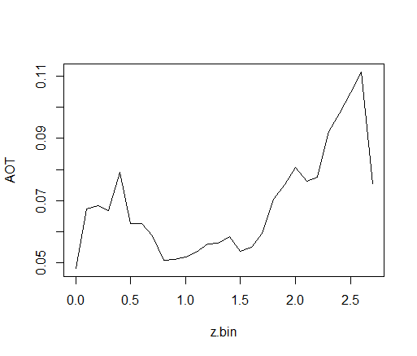

# iPhone Surface Area
Functions to calculate surface area from iPhone lidar data

## Getting Started

### Prepare Tree-level TLS Data
First we must clean the iPhone data. We recommend [CloudCompare](https://www.danielgm.net/cc/]) to open these meshes and isolate trees (or whatever you need to calculate surface area for). Sometimes meshes are rotated by 90 degrees or more, so adjust the rotation of your mesh data accordingly.

Once these meshes are prepared save using the '.off' format. The algorithm can currently only accept this format for processing.

### Setup
```{r echo=T, results='hide'}
library(data.table)
source('input/SA_FUN.R')
#find the 3D files
files<-list.files("input", pattern=".off", recursive = TRUE, full.names = TRUE)
```

### Run Surface Area Function

```{r}
SA.all<-SA(files[1])
```

### Check the output
We can now look at the SA output :
```{r}
#if heights are not normalized, do it now.
SA.all$z<-SA.all$z-min(SA.all$z)

#we can bin to 10 cm vertical intervals to see the vertical distribution of SA
SA.all$z.bin<-floor(SA.all$z*10)/10

#aggregate to 10 cm bins
SA.ag<-aggregate(AOT~z.bin,FUN='sum',SA.all)

#plot it!
plot(SA.ag, col="white")
lines(SA.ag)

```


Stay tuned for an upcoming paper using this function!
